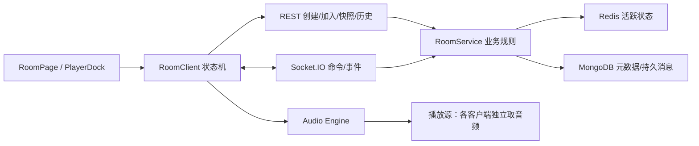

# 一起听歌功能技术路线

> 2026-10-04 制定的实施方案。第 2～9 节保留动工前的规划记录，其中涉及公开房、口令房、协作者、持久消息和房间设置的内容已废弃。当前行为以第 10 节、[README](../README.md) 和代码为准。

## 1. 目标与首版边界

最多两名用户通过邀请链接加入同一个房间，看到相同歌曲和队列。房主控制播放，双方均可点歌和聊天；成员在各自设备上从播放源独立获取音频并对齐进度。服务端同步控制状态，不转发音频，不广播播放 URL 或网易云凭据。

当前版本支持创建房间、邀请链接、加入/退出、在线成员、房主播放/暂停/跳转/切歌、队列、临时文本聊天、断线重连和结束房间。房间规则固定，不提供设置入口。

## 2. 动工前基础和阻塞项

| 模块 | 已有 | 必须补齐 |
| --- | --- | --- |
| 播放器 | `PlayerDock` 使用 HTML Audio；`playerStore` 保存个人队列、进度和音量 | 抽出唯一 Audio Engine，增加房间播放模式和本地/房间队列切换；避免两个页面各自创建播放器 |
| 播放源 | 已有歌曲元数据、临时播放 URL 解析与缓存 | 各成员分别解析 URL；处理会员、地区、登录、URL 过期和浏览器自动播放拦截 |
| HTTP 房间接口 | `POST /rooms`、快照、结束接口已有雏形 | 真实会话、加入鉴权、人数上限、邀请码存储、成员列表、队列命令、消息历史 |
| Socket.IO | 加入、时钟 ping、部分播放命令和文本聊天已有雏形 | 可信握手、完整命令、事件校验、去重、原子版本更新、准备状态、重连快照、离房和房主移交 |
| 存储 | MongoDB 有房间和消息模型；Redis 有状态和临时消息写法 | Redis 服务可用且受监控；在线成员和去重键；持久消息保留期；实例重启恢复策略 |
| 页面 | `RoomPage` 已有视觉界面 | 去除示例人数、聊天、曲目、进度、邀请码及固定“已同步 42 ms” |

目前 `actorFrom()` 信任客户端发送的 `x-user-id`，Socket.IO 握手也信任客户端发送的 `userId`；这些值不能用于正式房主权限判断。当前 `RoomPage` 是演示页面。检查本机 `/api/v1/health` 时 MongoDB 可用而 Redis 不可用；正式房间上线前必须解决 Redis 可用性。

## 3. 技术选择

| 关注点 | 方案 | 选择理由 |
| --- | --- | --- |
| Web 应用 | React + Zustand + TanStack Query | 沿用现有代码；REST 数据用 Query，房间瞬时状态用独立 store |
| 实时通信 | Socket.IO 4 + 现有 Redis Adapter | 已接入，具备房间广播、ACK 和自动重连；不为控制事件引入 WebRTC |
| 活跃状态 | Redis 8 + ioredis | 房间状态、成员心跳、命令去重与临时消息需要低延迟和 TTL |
| 长期数据 | MongoDB 8 + Mongoose | 沿用房间元数据、持久消息和审计模型 |
| 协议 | `@tmusic/contracts` 中的 Zod schema | 客户端与服务端共用事件定义，并在服务器入口校验所有不可信输入 |
| 音频 | 浏览器 HTML Audio | 每位成员独立从网易云取流；房间服务不存音频文件 |

首版保留普通 Redis Adapter 与应用层“版本号 + 快照重连”机制。Socket.IO 官方说明普通 Redis Adapter 基于 Pub/Sub，不持久化事件，也不支持内置连接状态恢复；因此不能依赖它补齐断线期间错过的消息。多实例部署使用轮询传输时需要会话粘滞；若固定 WebSocket 传输，可再按实际代理环境验证。[Redis Adapter 文档](https://socket.io/docs/v4/redis-adapter)、[连接恢复文档](https://socket.io/docs/v4/connection-state-recovery)。

## 4. 分层架构与模块边界



- **表示层**：显示成员、同步状态、控制权限和错误；只派发意图，不计算权威状态。
- **客户端房间层**：管理 `connecting → joining → preparing → synced → reconnecting → left`；存储最后收到的版本号、时钟偏移和连接状态。
- **Audio Engine**：单一音频实例，负责加载、播放、跳转、音量、播放错误；个人模式和房间模式共用引擎。音量仍是每个用户自己的设置。
- **HTTP/Socket 入口层**：校验会话、票据、房间身份和 Zod 消息；返回统一错误码与 ACK。
- **领域层**：房间生命周期、角色、人数、队列、播放命令、去重、移交和消息策略。入口层不直接改 Redis 状态。
- **存储层**：封装 Redis 原子更新和 MongoDB 读写，明确失效与恢复行为。

## 5. 前置功能

### 5.1 身份与加入凭据

先实现服务端签发的稳定 TMusic 身份。可使用 HttpOnly、Secure、SameSite 会话 Cookie；REST 创建/加入操作校验会话和 CSRF。快照/加入接口在验证房间加入条件后发放短时、单房间、单次或可轮换的实时票据；Socket 握手验证票据，并把可信 `userId`、`roomId`、`role` 写入服务端 `socket.data`。不要从客户端传来的 `userId` 决定权限。

邀请令牌使用高熵随机值，只存哈希、过期时间和撤销状态。口令房的口令存密码哈希。加入时原子检查房间状态、可见性、人数上限和是否已加入；同一用户多标签页的计数规则要固定，建议按用户计人数、按连接计在线状态。

### 5.2 播放器与播放源

把 `PlayerDock` 里的 Audio 生命周期、进度更新、URL 解析和错误处理抽到 `AudioEngine`。房间模式以服务端队列为准，不把房间控制写入个人持久化队列。进入房间保存个人播放上下文；退出时恢复个人队列与播放状态。

每次切歌先解析当前用户可用的播放 URL。会员、地区限制、登录失效等错误只影响该成员，并标记为“无法跟播”；不得拖住整个房间。`audio.play()` 可能因浏览器策略被拒绝，界面必须提供“点击继续播放”。[MDN 播放接口](https://developer.mozilla.org/en-US/docs/Web/API/HTMLMediaElement/play)。

### 5.3 Redis 与运行环境

正式房间依赖 Redis；Redis 不可用时创建、加入和控制房间应返回可识别的服务不可用错误，而不是在多实例下悄悄退回各自进程内存。MongoDB 不可用时应禁止需要持久化的操作。部署时 Redis 仅在可信内网开放，配置访问控制、内存上限、监控和恢复策略。

## 6. 数据模型与存储

| 位置 | 数据 | 规则 |
| --- | --- | --- |
| Redis `room:{id}:state` | 歌曲引用、播放锚点、`stateVersion`、队列、`queueVersion`、房主和房间状态 | 所有控制命令原子读改写；活动期间续期；结束后删除或短期保留结束标记 |
| Redis `room:{id}:members` | 用户、连接数、角色、准备状态、心跳时间 | 短 TTL；断线宽限期内保留成员身份 |
| Redis `room:{id}:commands` | 最近的 `commandId` 与执行结果 | 设置 TTL；重试返回同一结果，避免重复切歌 |
| Redis `room:{id}:messages` | 临时消息 | 只保留最近 N 条并设 TTL；房间结束时删除 |
| MongoDB `rooms` | 房间名称、房主、加入策略、设置、创建/结束时间 | 长期元数据，不按秒写播放进度 |
| MongoDB `roommessages` | 选择持久模式的消息 | 按房间和时间索引；按保留策略清理 |
| MongoDB 邀请/审计集合 | 邀请令牌哈希、撤销、必要操作记录 | 不保存明文口令、音频 URL 或网易云 Cookie |

播放状态的原子更新可用 Redis Lua 或 Redis Functions 实现“校验版本 → 去重 → 更新状态 → 返回新版本”。Redis 官方保证脚本原子执行；脚本必须短小，避免阻塞其他请求。[Redis 脚本文档](https://redis.io/docs/latest/develop/programmability/eval-intro/)。

## 7. 协议与同步算法

### 7.1 命令生命周期

1. 房主或有权限者发送 `playback:command`，带 `commandId`、`knownStateVersion` 和操作参数。
2. 服务端验证房间成员和权限；按 `commandId` 去重；在 Redis 原子比较版本并更新状态。
3. 服务端 ACK 成功结果或 `VERSION_CONFLICT`；成功时向房间广播完整的新播放状态。
4. 客户端只应用比本地版本新的状态；发现版本跳号时拉取完整快照。

支持 `PLAY`、`PAUSE`、`SEEK`、`NEXT`、`PREVIOUS`、`PLAY_TRACK` 和 `SET_REPEAT`。切歌同时更新当前曲目与播放锚点；队列操作单独使用 `queueVersion`。当前后端仅部分处理 `PLAY`、`PAUSE` 和 `positionMs`，不能把现有事件处理器直接视为完整协议。

### 7.2 播放位置

服务器广播时间锚点：`positionMs` 表示 `startedAt` 时的进度。播放中目标进度为：

```text
targetPositionMs = positionMs + max(0, estimatedServerNow - startedAt)
```

暂停时固定为 `positionMs`。客户端用多次 `clock:ping` 估算 RTT 和服务端时钟偏移，过滤高延迟样本。首次加入或切歌后先加载音频，`room:ready` 上报准备状态，再按目标位置播放。MVP 可以按现有需求采用 `<300 ms` 不处理、`300–1500 ms` 短时微调、`>1500 ms` 直接 seek 的策略；随后依据真实设备数据调整。不要每秒广播播放进度。

### 7.3 重连与消息

重连先重新验证身份和加入条件，获取快照，校验 `stateVersion`、`queueVersion` 与消息游标，再恢复播放。Socket.IO 默认投递语义不足以保证断线期间所有事件最终送达，因此关键状态靠权威快照和命令 ACK；聊天消息靠 `clientMessageId` 去重和历史补拉。[Socket.IO 投递保证](https://socket.io/docs/v4/delivery-guarantees)。

临时消息若因 Redis 故障无法按承诺保存，应明确发送失败；持久消息先成功写入 MongoDB，再广播。聊天拥塞不得阻塞播放控制。

## 8. 分阶段交付

| 阶段 | 开发内容 | 验收条件 |
| --- | --- | --- |
| 0. 基础设施 | Redis 启动与健康检查；可信身份；房间实时票据；共享协议 schema | 伪造 `x-user-id` 或 Socket `userId` 无法获得房主权限；Redis 不可用时返回明确错误 |
| 1. 最小闭环 | 真实建房/邀请/加入/退出；成员列表；统一 Audio Engine；房主播放、暂停、跳转 | 两个浏览器可听同一首歌；成员不能越权；界面无演示数据 |
| 2. 同步可靠性 | 时钟估算、准备状态、漂移修正、断线重连、版本冲突、命令去重 | 断线重连后恢复；重复命令只执行一次；切歌和跳转不会回退到旧版本 |
| 3. 队列与聊天 | 添加/移除/排序、点歌权限、临时与持久消息、历史补拉 | 队列多端一致；消息 ACK 和去重正确；保留策略生效 |
| 4. 完整房间能力 | 公开/口令/邀请制、人数上限、房主断线移交、结束清理、频控与审计 | 三种加入策略均在服务端生效；房主离线后可按规则恢复或移交 |
| 5. 扩容 | 两台 API 实例、代理配置、跨实例压测与监控 | 成员分布在不同实例时状态一致；故障后可从快照恢复 |

关键集成测试至少覆盖：两人加入、中途加入、房主与成员权限、重复命令、并发命令、掉线重连、浏览器阻止自动播放、单个成员曲目不可用、Redis 故障和多实例广播。上线观测指标包括房间数、加入失败率、控制命令延迟与冲突率、重连成功率、播放漂移分布和无法播放比例。

## 9. 建议的首批代码改动位置

1. `packages/contracts/src/index.ts`：补全房间命令、事件、快照、ACK 与错误 schema。
2. `backend/src/lib/http.ts` 与 `backend/src/realtime/registerRealtime.ts`：替换开发身份，验证会话和实时票据。
3. `backend/src/services/roomService.ts`：拆出权限、成员、原子状态更新、队列和生命周期服务。
4. `backend/src/routes/rooms.ts`：创建、加入、快照、历史、离开及结束接口。
5. `frontend/src/components/player/PlayerDock.tsx`、`frontend/src/stores/playerStore.ts`：抽出 Audio Engine 与房间播放模式。
6. `frontend/src/pages/RoomPage.tsx`：接入真实快照、Socket 事件、播放状态和聊天。

首个实施任务应是**阶段 0：身份可信化、Redis 可用化、协议定稿**。这三个前置条件决定后面的同步、权限与多实例行为是否可靠。

## 10. 当前实现状态

已落地：签名访客会话、单房间实时票据、双人邀请链接加入、成员与房主移交、播放和队列同步、双方点歌、临时文本聊天、断线重连及 Mongo 操作审计。无需好友关系即可通过链接加入。生产环境缺少 Redis 时房间接口返回不可用错误。

待部署验证：本地环境没有可用的 Redis 服务，因此跨 API 实例广播、Redis 故障恢复与代理环境压测尚未完成；浏览器自动播放和会员歌曲可用性还需要在真实用户设备上验收。阶段 5 的监控指标和容量压测仍是上线前工作。
