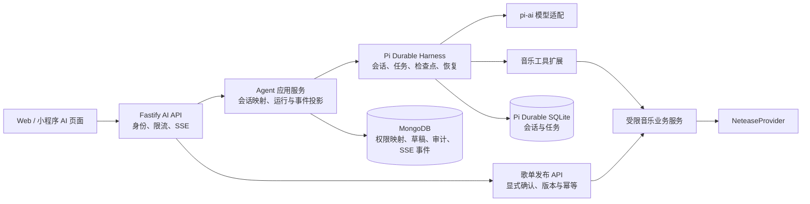

# TMusic Agent 模块：需求分析、技术路线与整体架构

> 2026-10-09。本文是设计方案，尚未表示 Agent 已接入。以当前仓库代码和文末所列官方资料为依据；Pi Durable 仍是实验性包，实施时需锁定并验证具体版本。

运行中的思考摘要、Plan、Todo、Step、分层职责和 Pi 包边界见 [Agent SOP 与 Pi 边界](./07-agent-sop-and-pi-boundaries.md)。

## 1. 目标与边界

TMusic 的 Agent 首先是音乐助手：用户用自然语言描述心情、场景、风格或已有歌曲，系统检索真实曲目、给出有依据的推荐，并可整理成可编辑的歌单草稿。用户能在多个设备继续同一会话；生成中断或服务重启后，能够恢复或明确显示失败状态。Web 与未来小程序使用同一套后端协议。

首版完成以下闭环：

1. 新建、列出、读取、归档与删除本人会话；发送消息、流式查看、停止生成。
2. 通过受限工具搜索歌曲和读取详情；回答中展示标准 `TrackRef` 卡片，注明推荐理由与来源。
3. 生成、编辑歌单草稿。正式创建网易云歌单只能由用户在页面上显式点击确认。
4. 请求去重、进程重启恢复、错误展示、调用审计与基本成本控制。

首版暂不包含自主修改播放队列、自动发布歌单、联网通用搜索、多 Agent 自主规划和向量化 RAG。用户喜好读取和知识库检索属于后续增量能力，须先完成授权、数据来源与效果评测。

### 1.1 用户场景与优先级

| 优先级 | 场景 | 可验证结果 |
| --- | --- | --- |
| P0 | “找适合雨夜阅读、不太悲伤的华语歌” | 返回真实曲目卡片、简短理由；找不到时明确说明，不编造歌曲 |
| P0 | 对推荐追问、替换某首歌或要求换风格 | 延续本人会话，并根据新要求重新检索或调整结果 |
| P0 | 网络断开、重复发送、服务进程重启 | 可重新连接、请求不重复生成；运行最终状态可查 |
| P1 | “把这些歌整理成歌单”并调整顺序 | 生成本人可编辑草稿；版本冲突可恢复 |
| P1 | 用户确认保存到网易云 | 明确显示发布结果；不确定的上游写入进入对账状态 |
| P2 | “结合我最近常听的歌推荐” | 仅在用户授权且账号数据可用时读取偏好，可撤销授权 |

首版质量门槛建议用实测基线确定，再写入发布门禁：重点测真实曲目命中率、虚构曲目率、错误可播放承诺率、首 token 延迟、每次对话成本与重启恢复成功率。目标数字应在选定模型、部署环境和样本集后确定，避免把未经测量的指标写成保证。

## 2. 当前项目基线

| 部分 | 已有能力 | Agent 接入所需工作 |
| --- | --- | --- |
| 前端 | `frontend/src/pages/AiPage.tsx` 已有对话和草稿视觉界面 | 当前回复、历史、推荐卡片均为演示数据；接真实 API、SSE、取消与断线恢复 |
| 后端 | Fastify、MongoDB、Redis、网易云 Provider | 新增 Agent 运行时、AI 路由、会话投影、草稿模型、事件适配与审计 |
| 音乐数据 | `NeteaseProvider.searchCatalog()`、曲目详情、用户音乐库、歌单写接口 | 包装为受限工具，复用业务校验；返回标准 `TrackRef` |
| 共享契约 | `@tmusic/contracts` 有 `TrackRef` | 增加 AI 请求、响应、卡片与 SSE 事件 schema |
| 文档 | PRD §6.7 和 API 契约 §9 已描述 AI | 修正工具边界：`publish_playlist_draft` 不暴露给模型；发布仍为用户显式 API |
| 身份 | `actorFrom()` 读取 `x-user-id`，缺省为 `dev-user` | 这不是可信身份。私人 AI 数据或写操作上线前必须换为服务端验证的会话 |

MongoDB 和 Redis 当前允许不可用时降级运行。AI 的会话映射、权限和草稿不能采用这种内存降级；依赖不可用时应返回明确的服务不可用错误。

## 3. 架构模式选择

主流 Agent 设计通常从“模型 + 工具 + 检索/记忆”开始，在确有复杂控制流时增加工作流、委派或多 Agent。Anthropic 将预定义控制路径的 workflow 与模型动态决定工具步骤的 agent 区分；OpenAI Agents SDK 提供单 Agent、manager/agents-as-tools 与 handoff；LangGraph 区分线程检查点和跨线程长期存储；Microsoft Agent Framework 也建议先用能满足需求的最简单模式，再引入工作流编排。[1][2][3][4]

TMusic 首版选择 **单主 Agent + 受限工具 + 应用层确定性写流程**：

- 模型决定何时搜索、查看曲目、整理建议；工具只能访问明确授权的业务接口。
- 应用代码负责身份、配额、曲目有效性、草稿版本和正式发布；模型输出不成为写操作授权。
- Pi Durable 承担会话、模型轮次、工具任务及恢复；它不是用户系统、业务数据库或前端协议的替代品。
- 若未来出现可测量的复杂子任务，如多来源资料检索与独立复核，再将专门任务封装为 Pi Durable 的子会话或确定性任务。其子 Agent 需要应用自己定义，包本身没有开箱即用的子 Agent 编排。[5][6]

与候选方式的关系：

| 方式 | 适合情况 | 当前结论 |
| --- | --- | --- |
| 单轮模型调用 + 检索 | 固定问答、无需连续工具使用 | 可作基线评测；不能覆盖多轮检索和草稿整理 |
| 单 Agent 工具循环 | 音乐发现、解释与草稿生成 | 首版主路线 |
| 显式工作流/状态机 | 发布、外部副作用、审批、批量导入 | 用应用代码或 Pi Durable 自定义任务处理 |
| Manager + 子 Agent | 任务可拆成独立专长且收益超过延迟、成本 | 延后，以评测数据决定 |
| 完全自主多 Agent | 长程开放任务 | 与当前音乐助手需求不匹配 |

## 4. 逻辑架构

### 4.1 模块职责

| 模块 | 职责 | 不应承担 |
| --- | --- | --- |
| AI API | 校验身份/输入、公开 REST/SSE、停止运行、限制配额 | 直接组装模型消息或执行网易云写入 |
| Agent 应用服务 | 用户与 Pi 会话映射、提交去重、运行状态、事件投影、恢复协调 | 保存网易云明文凭据 |
| Pi Durable Harness | 持久化会话、任务、工具调用意图、重启恢复、上下文压缩 | 判断用户是否有权访问某个 TMusic 会话 |
| 模型适配 | 用 pi-ai 配置供应商、模型、超时与模型版本 | 把供应商响应结构暴露到前端 |
| 音乐工具扩展 | 严格 schema、输入限制、调用业务服务、返回可解释的结构化结果 | 直接操作 MongoDB 或调用无界 shell/文件工具 |
| 音乐业务服务 | 统一检索、详情、可用性、用户喜好与歌单规则 | 信任模型生成的曲目或权限信息 |
| 事件投影 | 将 Pi 的快照/增量转换为约定的 SSE 事件 | 把模型思维链、系统提示词、密钥或原始工具异常送到客户端 |

首版可将 Harness 嵌入单实例 Fastify 进程，以减少服务间通信。存储文件使用受备份保护的持久卷，启动时只打开一次并调用 `resume()`。Pi Durable 官方明确：一个存储同时只由一个进程持有，没有跨进程锁。需要多 API 实例时，将 Harness 移到单独的 Agent 进程，API 通过内部 RPC/消息通道访问；不能让多个 Fastify 实例打开同一 SQLite 文件。[6]

## 5. 数据与运行流程

### 5.1 数据归属

| 数据 | 权威位置 | 原因 |
| --- | --- | --- |
| 对话内容、Pi 任务与检查点 | Pi Durable 持久化存储 | 恢复生成和工具执行所需 |
| 会话所有者、标题、归档/删除状态、Pi ID 映射 | MongoDB | 业务查询、鉴权与列表 |
| 歌单草稿、版本、发布状态 | MongoDB | 用户编辑、审批与业务写入 |
| 运行 SSE 序号和短期重放事件 | MongoDB 持久投影，设置保留期 | 满足现有 `Last-Event-ID` 契约 |
| 用户偏好（后续） | 独立受控用户数据 | 跨会话记忆，不与会话压缩摘要混为一谈 |
| 网易云 Cookie | 现有加密凭据模型 | 工具执行时按用户 ID 读取，不写入 Pi transcript、日志或模型上下文 |

Pi Durable 的 conversation ID 与公开 AI conversation ID 分开。会话创建涉及 Pi 存储和 MongoDB 两处，不能假设跨库原子提交；采用状态为 `CREATING` 的映射记录、幂等创建键和启动/定时对账，处理只创建成功一侧的孤儿记录。每次读取、订阅或取消都先核对服务端身份与映射所有者。删除会话要定义保留策略：前端隐藏/归档、Pi 数据清除与审计留存分别处理。

### 5.2 发送与恢复

1. API 验证会话所有权、消息长度、授权状态和速率限制，绑定 `clientMessageId` 到用户及会话。
2. 对映射出的 Pi 会话调用 `conversation.submit({ type: 'input', content, requestId })`；`requestId` 由用户 ID、会话 ID 和 `clientMessageId` 确定，重试得到同一 submission。公开 `runId` 映射该 submission；不能假定不同 ID 命名空间天然一致。[6]
3. Pi Durable 提交模型/工具任务，Agent 应用服务订阅状态，向前端发送 `run.started`、`message.delta`、`tool.started`、`content.card` 等公开事件。
4. 进程重启后 `Harness.open()` + `resume()` 恢复未完成任务；客户端重连先检查当前快照，再从短期事件投影补齐可重放事件。Pi 的 `watchEvents()` 提供快照与实时更新，慢消费者可能收到新快照，因此它本身不是无限期、按 `Last-Event-ID` 重放的事件日志。[6]
5. 停止生成映射为 Pi 会话 `abort()`；中断后的最终状态和已提交消息从 Pi 状态读取，避免前端仅凭 SSE 断开推断成功或失败。

事件投影和 Pi 提交位于不同存储，不具备同一事务。设计上以 Pi 状态为事实源，SSE 投影可重建；若某段增量已丢失，发送最新快照并从其状态继续，而不承诺凭空恢复每个历史 token。需要严格逐事件重放时，应另行证明投影的持久写入与 Pi 状态对齐。

### 5.3 工具清单和副作用

| 工具/操作 | 首版 | 恢复策略与边界 |
| --- | --- | --- |
| `search_tracks` | 是 | 只读，可 `replay: 'safe'`；限制关键词、结果数与频率 |
| `get_track_detail` | 是 | 只读，可安全重放；校验 `provider/sourceId` |
| `get_user_taste` | 后续 | 用户明确授权后读取，按当前用户权限执行；不持久化明文凭据 |
| `create_playlist_draft` | 第二阶段 | 写草稿；以 Pi 工具任务 ID 做幂等键，避免崩溃重试重复建草稿 |
| `add_tracks_to_draft` | 第二阶段 | 校验草稿归属、版本、曲目存在与去重；幂等更新 |
| `publish_playlist_draft` | 不给 Agent | 仅用户点击后走发布 API；需版本、`Idempotency-Key` 和失败对账 |

Pi Durable 对工具调用先持久化意图；被中断的工具只有声明可安全重放才自动重试。`replay: 'safe'` 不能仅因为“希望重试”就设置：外部副作用必须自身有稳定幂等键和对账机制。网易云创建歌单可能发生“上游成功、进程在本地记账前退出”，而现有 Provider 没有可证明的上游幂等保证。因此首版发布不能宣称端到端 exactly-once；设计发布状态为 `PENDING`/`CONFIRMED`/`NEEDS_RECONCILIATION`，在不确定结果时核查用户歌单，避免盲目重试创建。[5][6]

## 6. 检索、记忆与推荐质量

首版先用现有音乐目录搜索作为 grounded retrieval。模型只生成检索词、筛选与解释；展示的歌曲 ID、名称、艺人和可用性必须来自 Provider 返回的标准化结果。曲目卡片只在后端确认 `TrackRef` 后生成，播放仍通过现有播放授权接口解析；不能把搜索命中等同于对所有账号可播放。

跨会话偏好独立于 Pi 对话历史：用户授权后，从喜欢、最近播放、歌单等来源提取少量可解释的偏好特征，允许查看和撤销；不把敏感用户数据放进公共向量库。Pi 的上下文压缩服务于长会话继续运行，不应作为唯一长期偏好数据库。[3][6]

当真实曲库搜索对“氛围、场景、相似风格”表现不足，且离线评测显示收益时，再引入 RAG：索引歌曲/歌手/专辑元数据、许可范围内的标签和编辑资料；检索结果带来源与更新时间。未经授权的完整歌词不进入索引。初期可用关键词/过滤加重排，向量检索属于可选优化。

## 7. 权限、安全与运行约束

- **身份**：替换 `actorFrom()` 对客户端 `x-user-id` 的信任，接入服务端签名会话或等效验证；无可信身份时不开放私人 AI 数据和写操作。
- **工具授权**：每次调用从会话映射解析当前用户，再由业务服务判断权限；不能从模型参数接受 `userId`、Cookie 或任意 URL。
- **输入/输出**：Zod/TypeBox 校验、限制文本和工具结果大小、过滤外部内容中的指令注入；系统提示词不能代替工具层权限。公开 SSE 只发白名单字段。
- **资源预算**：每用户并发 Run、每 Run 模型轮数/工具次数、搜索结果数、超时和 token/费用上限；模型或网易云不可用时给明确可重试错误。
- **数据保护**：日志脱敏 Cookie、密钥、私人偏好和模型内部内容；设置对话、草稿、事件日志的保留与删除策略。
- **可观测性**：关联 `requestId`、公开 `runId`、Pi submission/任务 ID、工具名、耗时、失败码、token/费用；保存可审计的工具摘要，不记录原始敏感结果。

## 8. 分阶段技术路线与验收

| 阶段 | 工作 | 验收条件 |
| --- | --- | --- |
| 0. 基础 | 可信身份；确定单实例持久卷、模型供应商与密钥；锁定 Pi Durable 版本；离线评测样本 | 越权读取/停止会话被拒绝；重启后 SQLite 数据仍在 |
| 1. 最小可用 | Harness、pi-ai、只读工具、会话映射、AI REST/SSE、前端真实对话 | 两轮对话能检索真实歌曲并显示卡片；重复 `clientMessageId` 不产生第二轮；重启后可恢复或明确失败 |
| 2. 草稿闭环 | 草稿模型、创建/编辑工具、确认发布 API、版本和幂等对账 | Agent 不能直接发布；用户编辑后旧版本发布被拒；不确定上游结果不盲目二次创建 |
| 3. 个性化与质量 | 授权偏好读取、推荐评测、必要时元数据 RAG | 用户可撤销偏好访问；与阶段 1 基线相比，离线命中与真实用户反馈有可测提升 |
| 4. 扩容与专长化 | 独立 Agent 进程/存储适配；有收益时增加子 Agent 或显式工作流 | 多 API 实例不共享打开同一 Pi 存储；故障恢复和取消语义通过集成验证 |

建议维护一组固定评测：模糊场景找歌、明确歌曲查询、曲名歧义、不可播放曲目、草稿修改、越权用户、重复提交、模型与网易云故障、工具执行中重启。记录正确曲目率、解释依据可核对率、卡片可播放率、首 token 延迟、完整耗时、工具失败率和每 Run 成本；模型、提示词或检索调整都对照同一批样本。

## 9. 实施前需要定下的设计决策

1. 身份方案：TMusic 自有账号会话，还是将经验证的网易云账号作为应用身份；两者都不能只依赖客户端传来的用户 ID。
2. 模型供应商和部署区域，以及密钥、费用预算与用户数据处理要求。
3. AI 会话与事件保留期；删除是否要求物理清除 Pi 会话及备份。
4. 部署目标：首版单实例持久卷，还是从一开始就需要多实例；后者要先设计 Agent 单写入进程或通过 Pi 存储一致性测试的自定义后端。

## 参考资料

1. [Anthropic, Building effective agents](https://www.anthropic.com/engineering/building-effective-agents)。模式划分与从简单方案开始的原则。
2. [OpenAI Agents SDK, Agent orchestration](https://openai.github.io/openai-agents-js/guides/multi-agent/)。manager、handoff 与代码编排的取舍。
3. [LangGraph, Persistence](https://docs.langchain.com/oss/javascript/langgraph/persistence)。会话检查点与跨会话长期存储的区分。
4. [Microsoft Agent Framework, Workflows](https://learn.microsoft.com/en-us/agent-framework/journey/workflows)。工作流、审批与检查点的适用边界。
5. [Earendil, Pi Durable](https://earendil.com/posts/pi-durable/)。Harness、任务、扩展、恢复与子会话设计。
6. [Pi Durable 官方 README](https://github.com/earendil-works/pi/blob/main/packages/durable/README.md)。安装、API、存储、观察事件与恢复语义；实施时以锁定版本源码为准。
