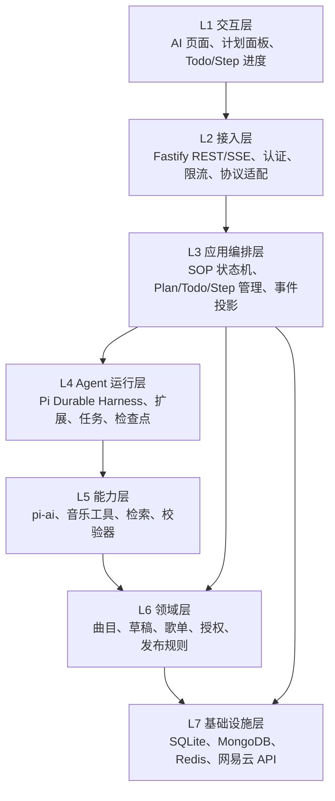
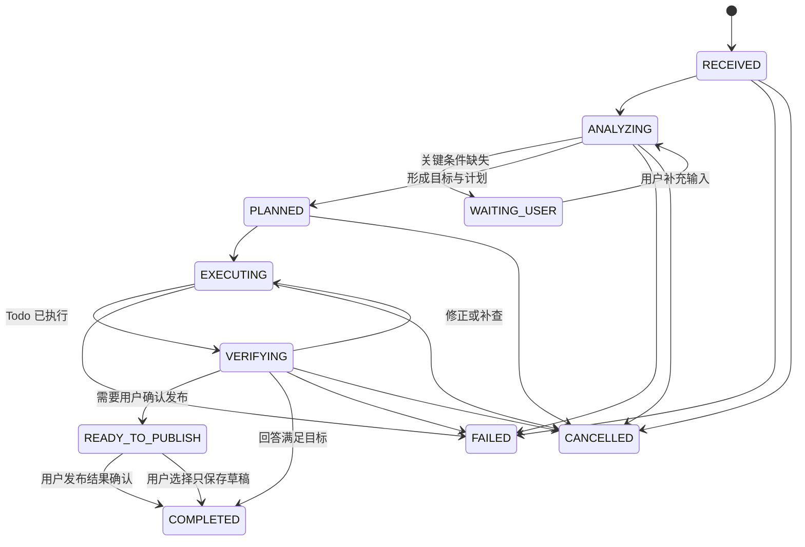

# TMusic Agent SOP、分层架构与 Pi 包边界

> 2026-10-09。本文补充 [Agent 模块总体架构](./06-agent-module-architecture.md)，定义运行中的思考摘要、Plan、Todo、Step 及其恢复规则。首版实现与差异见 [Agent 模块接入与运行说明](./08-agent-implementation.md)。

## 1. 先回答：接入 Pi Durable 等于接入整个 Pi Agent 吗？

**不等于。** Pi 仓库是 monorepo，至少有三种不同层级的包：

| 包 | 源码中的定位 | TMusic 的选择 |
| --- | --- | --- |
| `@earendil-works/pi-ai` | 多模型 API、消息与工具参数基础能力 | 随 Pi Durable 使用，配置模型供应商 |
| `@earendil-works/pi-agent-core` | 可嵌入的有状态 Agent loop、工具执行与事件流 | 用来参考事件和循环设计；首版不作为运行时 |
| `@earendil-works/pi-durable` | 带持久化会话、生成任务、工具任务、文档和恢复能力的 Harness | **TMusic 的唯一 Agent 运行时** |
| `@earendil-works/pi-coding-agent` | 基于 Pi 包的交互式编码 CLI 与文件、shell 工具 | 音乐产品不接入 |

从官方 `package.json` 可见，`pi-durable` 依赖 `pi-ai` 和 `chord`，**没有依赖 `pi-agent-core`**。Pi Durable 自己提供 `Harness`、内置 generation/tool tasks 和可扩展工具循环。不要同时启动 `pi-agent-core.Agent` 的 loop 与 Pi Durable 的 loop，否则产生两套消息、事件和恢复语义。[Pi 仓库包表][pi-repo]、[pi-durable package.json][pi-durable-pkg]、[pi-agent-core package.json][pi-agent-pkg]、[Pi Durable README][pi-durable-readme]

可以借鉴 `pi-agent-core` 的 **输入 → 模型轮次 → 工具调用 → 工具结果 → 下一轮 → 结束** 事件顺序，但 TMusic 的持久化状态和事件事实源必须落在 Pi Durable 中。[pi-agent-core 事件说明][pi-agent-readme]

## 2. 分层架构与依赖方向



依赖规则：

- UI 只认识公开 `conversation/run/plan/todo/step` 契约，不认识 Pi 内部 task ID 或模型供应商对象。
- API 完成身份和请求校验后调用应用编排层；不能让模型直接访问 Fastify request、Cookie 或数据库连接。
- 应用编排层拥有 SOP 和用户可见状态；Pi Durable 拥有会话与任务的持久化执行。应用层用 Pi 的 `defineDoc`、扩展和 hook 记录 SOP 状态，但业务权限仍由应用层与领域层决定。
- 能力层把工具参数转换为明确的领域命令。每个工具执行前重新检查当前用户、资源归属和预算；任何模型参数都不能自称 `userId`。
- 领域层维持可重复使用的音乐规则。歌单发布属于领域命令，经过用户显式调用的 API，不成为 Agent 工具。
- 基础设施是实现细节；SQLite 是 Pi Durable 首版存储，MongoDB 是业务数据与投影存储，Redis 仅承担限流/短时协调，不承担 Agent 事实源。

### 2.1 与源码对应

| TMusic 层 | Pi 参考点 | 映射方式 |
| --- | --- | --- |
| Agent loop | `pi-agent-core` 的 `agentLoop` 与事件序列 | 参考运行概念，实际使用 Pi Durable 的内置 generation/tool tasks |
| 持久化执行 | Pi Durable `Harness`、`Conversation`、`Submission` | 每条用户输入为一个 submission/run；同一用户会话映射 Pi conversation |
| 自定义能力 | `defineExtension`、`defineTool`、`section`、`hook` | 安装音乐工具、SOP 提示段和执行前校验 |
| Plan/Todo 状态 | `defineDoc`、`commit`、`watchDoc` | 当前计划与清单在同一 Pi 会话中原子更新；公开状态另做投影 |
| Step 执行 | Pi 内置 tool task；必要时 `defineTask` | 实际工具调用或业务阶段对应可恢复执行；公开 Step 是应用语义，不直接等于一个 Pi task |
| 进度事件 | `watchEvents`、`watchTaskGraph` | 转换为 TMusic SSE；敏感信息过滤并支持客户端快照重连 |

Pi Durable 官方 `27-plan-mode.ts` 展示了用 `defineDoc` 保存计划、`submit_plan` 工具写入计划、用 `configure()` 切换只读计划模式；它是可借鉴的最小例子，TMusic 还需要增加校验、任务状态、证据和业务权限。[Plan mode 示例][pi-plan-example]

## 3. SOP：一次请求从理解到交付

所有 Run 都经过同一状态机。简单问答允许只有一条 Plan 和一个 Todo，保持状态模型一致；复杂请求展开多个步骤。每个阶段保存可恢复的公开状态，而不是依赖页面里的临时变量。



`READY_TO_PUBLISH` 是草稿业务状态；Agent Run 可以在给出草稿和待确认提示后结束，不应为了等用户点击而保持模型任务长期运行。用户后来点击发布会产生独立的发布操作及审计记录。

| 阶段 | 输入 | 必须产出的可见数据 | 结束条件 |
| --- | --- | --- | --- |
| 0. Receive | 用户输入、会话上下文 | `runId`、请求去重键、授权与预算快照 | 校验通过或明确失败 |
| 1. Analyze | 输入、允许使用的上下文 | **思考摘要**：目标、约束、所需信息、是否需要工具；不含内部推理文本 | 意图清楚，或提出具体澄清问题 |
| 2. Plan | 思考摘要、工具可用性 | 有版本的 Plan 和可执行 Todo | 计划条目通过 schema 与预算检查 |
| 3. Execute | 当前 Todo | Step 开始/完成记录、工具结果引用、错误码 | Todo 完成、阻塞或预算耗尽 |
| 4. Verify | Plan、Step 证据、真实曲目 | 检查结果、缺口与必要修订 | 每项结论有来源且业务规则通过 |
| 5. Respond | 验证后的结果 | 答案、曲目卡片、草稿卡片、未解决项 | Run 状态提交为完成/失败/取消 |

### 3.1 “思考过程”的产品边界

展示 **决策摘要**，例如“目标：推荐适合雨夜阅读的华语歌；约束：情绪不要太悲伤；需要搜索真实曲目并检查曲目详情”。用户可看到目标、计划、正在执行的步骤和验证结果。模型的原始推理 token、隐藏提示词、内部工具参数、凭据、未经核验的草稿内容不进入 UI/SSE；`thinkingLevel` 是模型运行配置，不是公开审计记录。[Pi Durable Agent 配置][pi-durable-readme]

思考摘要必须是可核对的结构化结果，字段为 `goal`、`constraints`、`assumptions`、`missingInformation`、`proposedApproach`。它只解释已做的选择，不声称能还原模型内部的完整思维链。若缺少决定性信息，给用户一个具体问题，Run 结束为 `WAITING_USER`；下次输入沿同一会话继续。

## 4. Plan、Todo、Step 的语义

| 对象 | 粒度 | 谁可改变 | 核心字段 | 作用 |
| --- | --- | --- | --- | --- |
| Plan | 一次 Run 的整体路线 | Agent 提议，编排层校验；用户可通过新输入修订 | `id`、`runId`、`version`、`goal`、`constraints`、`todos`、`status` | 说明要达到什么结果和处理顺序 |
| Todo | 一个可验证的子目标 | Agent 更新，编排层约束状态 | `id`、`title`、`acceptance`、`dependsOn`、`status` | 跟踪待办，避免漏项 |
| Step | 一次可观察执行或验证尝试 | 工具执行器/编排层记录；Agent 不能伪造成功 | `id`、`todoId`、`kind`、`attempt`、`inputSummary`、`evidenceRefs`、`status`、`errorCode` | 记录真正发生的动作和证据 |

推荐状态：Plan 为 `DRAFT → ACTIVE → COMPLETED | SUPERSEDED | BLOCKED | CANCELLED`；Todo 为 `PENDING → IN_PROGRESS → DONE | BLOCKED | SKIPPED`；Step 为 `READY → RUNNING → SUCCEEDED | FAILED | INTERRUPTED | CANCELLED`。Plan 修订增加 `version`，旧版保留在历史记录；Todo ID 在同版计划内稳定。Step 失败后重试创建新 `attempt`，不覆盖旧证据。

**状态约束：** Todo 完成必须有满足 `acceptance` 的 Step 证据；计划完成必须所有必要 Todo 完成或有明确的跳过原因；验证失败可新增或重开 Todo；外部写入不确定时 Step 进入 `INTERRUPTED`/待对账，不能自动标为成功。

示例：

```text
Plan v1：整理一份雨夜阅读华语歌单
  Todo 1：找出与场景相符的真实曲目
    Step 1：search_tracks("雨夜 阅读 华语") → 候选曲目引用
    Step 2：get_track_detail(候选 ID) → 标准 TrackRef
  Todo 2：核验曲目并给出推荐理由
    Step 3：检查 ID、艺人、可用性与去重 → 验证报告
  Todo 3：生成可编辑歌单草稿
    Step 4：create_playlist_draft(...) → draftId、版本 1
  发布：等待用户在页面点击；不作为 Agent Todo 自动执行
```

### 4.1 Plan 与 Pi Durable 的存储映射

- `PlanDoc`：Pi Durable `defineDoc`，`scope: 'conversation'`、`history: 'rewindable'`。只放当前 Run 的 Plan/摘要/当前 Todo 索引；新 Run 开始时更新。历史 Plan 作为不可变自定义 entry 或投影保存，避免一个 Doc 无限增长。
- `submit_plan` / `revise_plan`：受限工具，schema 限定条目数、文本长度、依赖关系、版本号。工具执行通过 `api.commit()` 写 Doc；若版本不匹配，返回冲突并要求重新读取。官方 Plan mode 示例提供基础写法。[Plan mode 示例][pi-plan-example]
- `Step`：由真正执行工具的包装器生成 `STARTED` 与终态，关联 `toolCallId` / Pi task ID；工具结果只保留必要引用、摘要和校验结果。可用 `ToolTask` hook 做前置阻断和后置记录，但不能把 hook 当成授权唯一防线。[Pi Durable hooks][pi-durable-readme]
- `Todo`：在同一 PlanDoc 中维护活动清单；只有验证器能把有证据的条目标为 `DONE`。面向列表和 SSE 的数据投影到 MongoDB，按 Pi 已提交状态重建。
- 长时间、确定性的业务流程（如批量歌单导入）以后可用 Pi Durable `defineTask` 分 phase/checkpoint；首版推荐流程可先用内置 conversation/tool tasks，避免重复实现一套任务调度器。[Pi Durable tasks][pi-durable-readme]

## 5. 每个阶段的执行规则

### 5.1 Analyze 和 Plan

1. 编排层把用户输入和**最小必要**的当前播放上下文送入 Agent；用户偏好仅在授权后加载。
2. Agent 先形成结构化思考摘要；无法判断时只问决定性的澄清问题。
3. 提交 Plan：每个 Todo 有明确完成条件，依赖无环，步骤数量和工具预算在限制内。简单查询仍写一项简短计划。
4. 编排层校验并提交状态后才允许执行工具。计划中禁止引入不存在、未授权或越权的能力。

Pi Durable 官方示例通过 `configure()` 临时提供只读工具和 `submit_plan`，再切回执行工具。TMusic 可采用这个模式，但切换工具集必须发生在已提交计划后；改变配置只影响后续模型请求，已启动的工具仍可能按原配置完成，因而工具本身必须重复校验权限。[Plan mode 示例][pi-plan-example]、[Pi Durable README][pi-durable-readme]

### 5.2 Execute 和 Verify

1. 每轮只选择满足依赖的 Todo；记录 `IN_PROGRESS`。模型提出工具调用，工具包装器在执行前验证 schema、当前权限、预算和 Plan 允许范围。
2. 只读工具可在可证明安全时重放；写草稿以稳定任务键幂等。Step 成功由工具返回和领域校验共同决定，不采用模型自报“已完成”。
3. 验证器检查曲目来源、去重、约束匹配、推荐理由证据、草稿版本；必要时把 Todo 退回并修订 Plan。
4. 超过轮数/成本/时间预算时停止继续调用，保存已完成证据，返回可理解的部分结果和未完成项。不能让模型无限循环。
5. 用户在运行中修改目标时，Pi Durable 的 `steer` 可在当前工具轮之后生效；编排层将已有 Plan 置为 `SUPERSEDED`，形成新版本，不静默改写已完成 Step。普通追加消息作为下一 Run。[Pi Durable busy conversations][pi-durable-readme]

### 5.3 Respond、取消与重启

- 回答引用已校验的 `TrackRef` 和草稿版本；对不可播放、来源未知或数据缺失的结果明确标识。
- 用户取消时，Pi `abort()` 停止运行树；公开 Plan/Todo/Step 投影由最终已提交状态更新，已发生的外部副作用依其对账规则处理。
- 进程重启后，重新注册同名扩展与任务定义，再打开同一存储并 `resume()`；恢复时读取 `PlanDoc`、Pi live tasks 和当前 submission，不重新生成新 Plan。被中断工具按其重放属性处理，投影与 SSE 从 Pi 状态对账。[Pi Durable 恢复与工具重放][pi-durable-readme]

## 6. API/SSE 增量建议

维持现有 `docs/02-api-contract.md` 的会话与 Run 接口，增加只读视图：

| 接口/事件 | 内容 |
| --- | --- |
| `GET /ai/runs/:runId` | Run 状态、当前 Plan 版本、Todo/Step 摘要与可恢复游标 |
| `GET /ai/runs/:runId/plan` | 当前 Plan、历史版本索引和验收条件 |
| `analysis.summary` | 可展示的目标、约束、待确认点；不含原始推理 |
| `plan.created` / `plan.revised` | 完整版本号和公开 Todo 列表 |
| `todo.updated` | Todo 状态、阻塞或跳过原因 |
| `step.started` / `step.completed` / `step.failed` | 工具的显示名、摘要、证据引用、公开错误码 |
| `verification.completed` | 核验结论、被剔除曲目和原因 |

事件必须有 `runId`、单调 `sequence` 和可重新获取的状态快照。SSE 仅用于增量展示；网络重连先读取 `/ai/runs/:runId` 快照，再按可用事件游标接续。前端不要从 `message.delta` 推断 Todo 或 Step 成功。现有 API 契约中的 `Last-Event-ID` 需要应用层短期事件投影；Pi 的 `watchEvents()` 不是永久事件日志。[Pi Durable watching][pi-durable-readme]

## 7. 文件落位建议与实施顺序

```text
backend/src/agent/
  runtime/          Harness 初始化、模型注册、恢复、存储生命周期
  extensions/       MusicTools、SopPlan、BudgetGuard
  sop/              状态 schema、Plan/Todo/Step 校验与转换
  projection/       Pi 状态 → Mongo 视图和公开 SSE
  services/         会话映射、运行、草稿、发布协调
backend/src/routes/ai.ts
backend/src/models/AiConversation.ts、AiRun.ts、PlaylistDraft.ts
packages/contracts/src/ai.ts
frontend/src/pages/AiPage.tsx
```

1. 先修可信身份，确定首版单实例 Pi Durable 存储，并将 Node 引擎下限从项目当前的 `>=22` 对齐到 Pi 包要求的 `>=22.19.0`。[Pi Durable package.json][pi-durable-pkg]
2. 实现最小会话、只读音乐工具和 Pi 重启恢复，验证真实曲目与 SSE。
3. 加入结构化思考摘要、PlanDoc、Todo/Step 投影及 SOP 状态门禁；用固定场景和故障注入测漏项、重试、取消。
4. 加入草稿创建/编辑和用户确认发布，再做幂等与不确定结果对账。
5. 用户偏好、RAG、子 Agent 仅在评测显示必要时增加；保持一套 Pi Durable 运行时。

[pi-repo]: https://github.com/earendil-works/pi#packages
[pi-durable-pkg]: https://github.com/earendil-works/pi/blob/main/packages/durable/package.json
[pi-agent-pkg]: https://github.com/earendil-works/pi/blob/main/packages/agent/package.json
[pi-durable-readme]: https://github.com/earendil-works/pi/blob/main/packages/durable/README.md
[pi-agent-readme]: https://github.com/earendil-works/pi/blob/main/packages/agent/README.md
[pi-plan-example]: https://github.com/earendil-works/pi/blob/main/packages/durable/test/examples/27-plan-mode.ts
